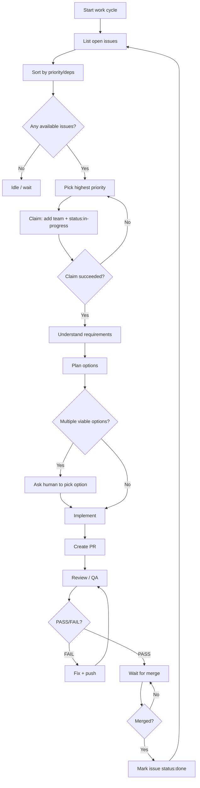

---
description: Turnkey GitHub Issues workflow (triage → plan → PR → review → merge)
---

# GitHub Issues Workflow

## Goal
Provide a repeatable, out-of-the-box workflow for turning GitHub Issues into shipped code changes with clear planning, ownership, and review loops.

## Prerequisites

### Tools
- `gh` installed and authenticated (`gh auth status`)

### Workspace setup (recommended)
Clone the target repository as a **git submodule** under `projects/` so agents can work on code locally:

```bash
# from the oh-my-code repo root
mkdir -p projects

# pick a local folder name (example: repo)
git submodule add "https://github.com/OWNER/REPO.git" "projects/repo"
git submodule update --init --recursive
```

Then run work from the submodule directory when implementing:

```bash
cd projects/repo
```

### Set your target repo once
```bash
REPO="OWNER/REPO"
```

## Label Conventions (Recommended)

### Team ownership (avoid duplicate work)
Use exactly one `team:*` label to claim an issue.
- Example: `team:core`, `team:frontend`, `team:infra`

### Status tracking
- `status:in-progress`
- `status:blocked`
- `status:done`
- `status:awaiting-human-merge` (optional, for queues)

## Workflow



## Step-by-step Commands

### 1) Find work
```bash
gh issue list --repo "$REPO" --state open
```

To focus on unclaimed issues (no `team:*` labels), use search:
```bash
gh search issues --repo "$REPO" --state open --search "-label:team:*"
```

### 2) Claim an issue (recommended)
Pick an issue number, then claim it:
```bash
ISSUE_NUMBER=123
TEAM_LABEL="team:core"

gh issue edit "$ISSUE_NUMBER" --repo "$REPO" \
  --add-label "$TEAM_LABEL" \
  --add-label 'status:in-progress'
```

If claiming fails (race with another team), pick another issue.

### 3) Understand → Plan (mandatory for non-trivial work)

#### Understand
- Summarize requirements, constraints, and acceptance criteria.
- Identify edge cases, risks, and test strategy.

#### Plan options
Use this structure:

**Option 1: <name>**
- Approach
- Pros/Cons
- Risk level
- Effort estimate

**Option 2: <name>**
- Approach
- Pros/Cons
- Risk level
- Effort estimate

**Recommendation**: Option X

If there are multiple viable options, stop and ask the human to explicitly pick one before implementing.

### 4) Implement → PR

Create a PR that links the issue:
```bash
gh pr create --repo "$REPO" --fill --title "<title>" --body "Closes #$ISSUE_NUMBER"
```

### 5) Review loop (PASS/FAIL)
For a quick checks snapshot:
```bash
gh pr view --repo "$REPO" --json number,title,state,mergeable,reviewDecision,statusCheckRollup
```

### 6) Merge policy (choose one)

#### Option A: Human-only merge (recommended for teams)
- When QA/review is PASS and checks are green: mark as waiting and notify the human owner.

```bash
gh issue edit "$ISSUE_NUMBER" --repo "$REPO" --add-label 'status:awaiting-human-merge'
```

#### Option B: Maintainer merge (default GitHub flow)
- Merge once checks/reviews are satisfied.

### 7) Close the loop after merge
After PR is merged:
```bash
gh issue edit "$ISSUE_NUMBER" --repo "$REPO" \
  --remove-label 'status:in-progress' \
  --add-label 'status:done'
```

## Output Contract (for agents)

Every work cycle update ends with:
1. **Summary** (1–3 bullets)
2. **Evidence** (exact commands run + outcomes)
3. **Files Changed** (paths)
4. **Risks/Assumptions**
5. **Next Step**

## Optional: AWAITING HUMAN MERGE Queue Cap
If you want to cap pending human merges (e.g., max 3 across teams), check before adding `status:awaiting-human-merge`:
```bash
gh search issues --repo "$REPO" --state open --label 'status:awaiting-human-merge'
```

